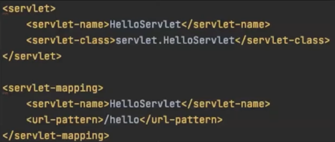
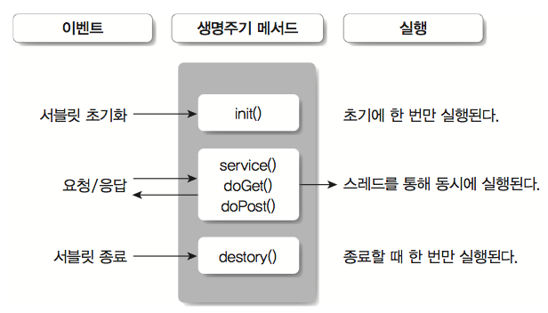
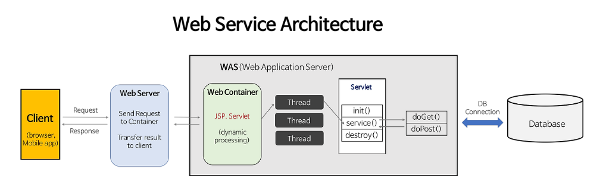
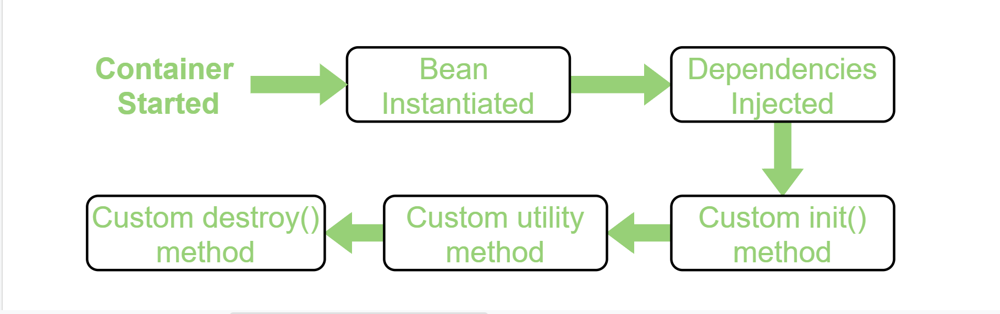
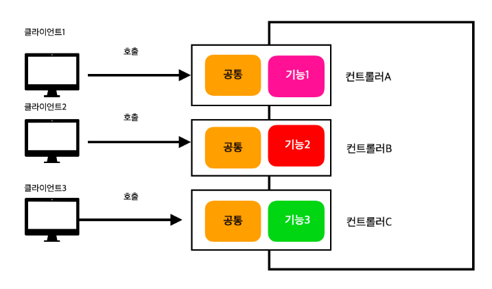
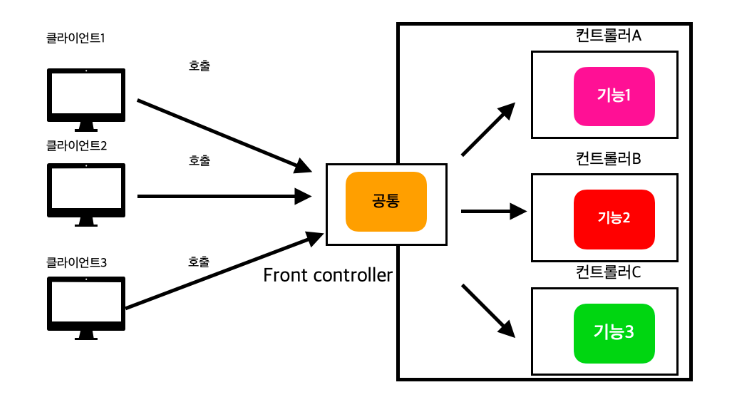

# :star: Servlet Container은 무엇인가요?

Servlet 객체의 생명주기를 관리하는 컨테이너

Servlet Container가 관리하는 Servlet은 동적 웹 페이지에서 사용된다. 그렇다면 동적 웹 페이지와 Servlet은 정확히 무엇일까?

웹 브라우저를 이용할 때, 우리는 두 가지 종류의 웹 페이지를 접할 수 있다.

**정적 웹 페이지 (Static Web Page)**

- Web Server에 이미 저장된 파일(HTML, CSS, JavaScript, 이미지..)을 클라이언트에게 단순히 제공하는 웹 페이지
- 사용자는 항상 고정된 웹 페이지를 보게 됨

**동적 웹 페이지 (Dynamic Web Page)**

- 상황에 따라 Web Server에 저장된 파일의 데이터를 추가/가공한 뒤 클라이언트에게 제공하는 웹 페이지

## :sparkles: Web Server(WS) vs Web Application Server (WAS)

이후 내용의 이해를 위해 Web Server와 Web Application Servet가 무엇이고 둘의 차이점이 뭔지 짚어보겠다.

**Web Server**

- 정적 컨텐츠를 제공하는 서버
- 동적 컨텐츠를 제공하기 위해선, 클라이언트의 요청을 WAS에게 전달 후 WAS에게 받은 결과를 클라이언트에게 전달하는 과정 필요
- Apache Server, Nginx, IIS...

**Web Application Server**

- 동적 컨텐츠를 제공하는 서버
- DB를 이용한 다양한 비즈니스 로직 처리를 위해 만들어진 Application Server
- "Web Container" 또는 "Servlet Container"라고 불림
- WAS = Web Server + Web Container
- Tomcat, JBoss...

> :question: **_WS와 WAS를 구분하는 이유_**  
>
> - if WS만 존재, 클라이언트의 요청에 대한 모든 데이터를 미리 만들어 놓고 이를 이용한 정적 컨텐츠를 제공해야 함 ~~(글만 봐도 비효율적임)~~
>
> - if WAS만 존재, WAS 혼자서 WS의 기능을 모두 수행해야 함. 서버의 부담이 큼
>
> :exclamation:효율적이며, 서버의 부담을 줄이기 위해선 서로의 역할 분담이 필요

## :sparkles: Servlet?

클라이언트의 요청(Request) 및 응답(Response)을 반환해주는 자바 웹 프로그래밍 기술

**Servlet 특징**

- 스스로 작동 :x: (:small_orange_diamond:Servlet Container가 관리)
- WAS에서 동적 페이지 생성
- MVC 패턴에서 Controller로 이용
- HttpServlet 클래스 상속받음
- 싱글톤 객체
- Thread-Safe 하지 않음

 

> :question: **HttpServlet이란?**  :exclamation: HTTP 프로토콜 서비스를 지원하는 클래스

## :sparkles: Servlet Container?

Servlet 객체를 관리해주는 Container (= Web Container, WAS)

**Servlet Container 역할**

- Servlet의 생명주기(Life Cycle) 관리
   
  : Servlet 객체의 생성, 초기화, 종료

- Servlet과 WS 간의 통신 연결
   
  : 서블릿과 웹서버가 통신할 수 있는 API 제공
   _(원래라면 소켓을 만들어야하는 복잡한 과정이 필요)_

- 멀티 스레딩 관리
   
  : Servlet에 여러 요청이 들어올 경우, 각 요청에 대한 스레드를 생성해 처리
   _(스레드의 개수 != 무한개)_
- 선언적인 보안 관리
   
  : 개발자가 직접 보안 관련 코드를 작성하는 것이 아닌, 파일에 보안 요구 사항을 선언하는 것만으로 Container가 알아서 요구사항에 맞게 보안 관리를 해줌

**Servlet 생명 주기**

클라이언트의 요청이 들어왔을 때 Servlet은 바로 호출되지 않는다. Servlet 객체 생성 및 초기화 단계를 거친 뒤 호출돼서 해당 요청을 처리한다.

1. 클라이언트의 요청이 들어온다면, Servlet Container는 관련 Servlet이 메모리(heap)에 있는지 확인

2. if 없다면, Servlet 객체 생성(Servlet Class) 및 초기화(init) 진행
3. if 있다면, service() 실행
4. Servlet 종료 요청이 들어오면, destory() 실행

 

> 위의 사진은 servlet 설정을 하는 web.xml파일의 일부분이다.
>   `<servlet-mapping>` 단락을 보면 `/hello` 라는 클라이언트의 요청이 들어왔을 때, `HelloServlet` 서블릿에서 처리한다고 설정해놓음.

    

**Servlet 생명주기 메소드**

- init()  

  - 서블릿 컨테이너에 의해 생성된 Servlet 객체를 초기화

  - 서블릿의 일생 중 단 한 번 호출

- service()  

  - 요청/응답 처리.

  - 요청이 GET, POST, PUT.. 중 무엇인지 구분하여 doGet(), doPost(), doPUT().. 메소드로 요청 전달
  - 메소드 return시, 해당 thread 제거됨

- destory()  

  - 서블릿이 소멸될 때 호출

  - Web Application 갱신 또는 WAS가 종료될 때 호출
  - Servlet 객체를 메모리에서 제거
  - 서블릿의 일생 중 단 한 번 호출

## :sparkles: Servlet Container 동작 과정

1. 웹서버가 HTTP 요청을 받고 서블릿 컨테이너에게 전달 (동적 컨텐츠에 관련된 요청)

2. 서블릿 컨테이너는 HttpServletRequest객체와 HttpServletReponse객체를 생성
3. 이후 요청을 처리할 서블릿에게 두 객체를 전달 (만약 처리할 수 있는 서블릿이 없다면, 새로운 서블릿 생성 및 초기화)
4. 서블릿이 요청 처리를 위해 service() 메소드 호출
5. 메소드 호출로 데이터 처리를 한 뒤, 결과값을 서블릿이 HttpServletResponse객체에 담아 클라이언트에게 전송
6. 응답이 끝난 뒤, HttpServletRequest객체와 HttpServletResponse객체 모두 소멸
    
   _(servlet객체는 싱글톤으로 관리되기 때문에 재사용을 위해 소멸 안됨)_

 

> :dizzy: **HttpServletRequest** : Http 요청에 담겨있는 정보가 들어있음  
> :dizzy: **HttpServletResponse** : 서블릿이 클라이언트에게 보낼 Http 응답 객체 (로직 처리 전까진 비어있음)

 

# :star: Spring Container는 무엇인가요?

- 자바 객체(Bean) 를 관리해주는 Container (= ApplicationCotext)

- 생성된 자바 객체에 추가적인 기능을 제공

## :sparkles: Bean?

- Spring Container가 등록, 관리하는 인스턴스화된 자바 객체

- 싱글톤(Singleton) 으로 관리되기 때문에 Spring Container가 한 번만 생성
   (컨테이너가 사라질 때 제거됨)

 

**Bean 등록 방법**

- Component scan

  - @Component 어노테이션 이용

  - 클래스 위에 @Component 를 붙이면 Spring이 자동으로 Bean을 등록
  - @Component 를 상속받은 어노테이션 또한 객체 생성해줌
     _(@Controller, @Service, @Repository, @Configuration)_

- Java 코드 등록

  - @Configuration과 @Bean 어노테이션 이용

  - 클래스 위에는 @Configuration을, 메소드 위에는 @Bean을 작성

- 수동 등록

  - .xml(설정파일)에 직접 Bean 객체 등록
  - `<beans:beans>` 태그 이용
       ~~잘 사용하지 않는 방법~~ 

**Bean 생성 순서**

- Spring

  - 설정파일(.xml)로 Bean을 등록

  - 위에서 아래로 스캔해서 파일에 등록된 Bean을 생성

 

- Spring Boot

  - Annotation을 이용해 Bean 등록

  - 패키지에서 존재하는 순서대로(위에서 아래로) 스캔해서 Bean 생성
    > :dizzy: Bean 생성자 호출 순서 : controller -> service -> >repository (패키지 알파벳 순)
    >   :dizzy: Bean 생성 완료 순서 : repository -> service -> controller
  - controller 생성자 호출 후 생성자의 파라미터를 봤을 때 생성되지 않은 Bean이라면 파라미터에 해당하는 Bean 먼저 생성하러 감
      (생성 후 다시 돌아와서 생성자 호출 로직을 이어감)

 

**Bean 생명 주기**

1. Spring Container가 생성됨
2. Spring Bean 생성
3. 의존 관계(DI) 주입
4. 초기화 콜백
5. Bean 객체 사용
6. 소멸 전 콜백
7. 스프링 종료

 

그렇다면 Bean객체를 이용해서 클라이언트의 요청을 처리할 텐데 어떻게 처리할까? 먼저 클라이언트의 요청을 받아주는 컨트롤러에 대해 알아보겠다.

## :sparkles: Front Controller?

Servlet을 이용해 클라이언트의 요청을 처리한다는 것을 위에서 배웠다. Servlet이 각각의 요청을 처리할 때, 공통적으로 처리하는 부분이 존재한다. 공통 처리부분이라 함은 인증과 인가, 받은 요청을 컨트롤러가 처리하기 쉽도록 변환, 처리 결과를 클라이언트에게 전달하기 위한 데이터 변환 등이 있다.
  위의 그림처럼 공통 로직을 여러 컨트롤러에 중복 작성돼있는 것은 비효율! 이를 보완하고자 Front Controller가 등장했다.

Front Controller는 이름 그대로 컨트롤러 앞에 있는 서블릿이다.
 비즈니스 로직을 처리하는 Handler 즉, Controller 앞에 위치해 공통 로직을 수행한 뒤 Controller에게 결과를 보내준다. 이 때문에 개발자는 공통 로직을 매번 작성해야 하는 번거로움이 덜게 돼 핵심 로직에만 집중이 가능해짐
 

이렇게 코드의 중복을 줄이기 위해 나온 디자인 패턴을 **프론트 디자인 패턴**이라 부름
 

프론트 컨트롤러가 없었다면 모든 컨트롤러에다 서블릿을 모두 구현해야 했다. 하지만 프론트 컨트롤러를 도입함으로써 개별 서블릿 구현없이 요청에 알맞는 컨트롤러를 찾아 호출만 하면 된다.
  _(서블릿이 컨트롤러에 없어지면서 컨트롤러는 서블릿 의존성에서 벗어남)_
 

그렇다면 Spring에서 클라이언트의 모든 요청을 받는 Front Controller는 어떻게 생겼을까?

## :sparkles: DispatcherServlet?

Servlet의 일종으로 Front Controller 역할을 한다.
 

- Servlet Container에 의해 관리

- 서블릿 컨테이너에게 모든 요청을 받아 인증, 보안, 로깅과 같은 공통 로직을 수행한다.

_(비즈니스 로직, 예외처리와 같은 실제 작업은 컨트롤러를 통해 수행됨)_

 

**DispatcherServlet 동작 과정**

1. DispatcherServlet이 서블릿 컨테이너에서 클라이언트의 모든 요청을 받음

2. 요청 정보를 HandlerMapping에 위임해서 처리할 Handler(Controller)를 찾기 시작함
3. 2번에서 찾은 Controller를 수행할 수 있는 HandlerAdapter를 찾기 시작
4. 찾은 HandlerAdapter는 비즈니스 로직을 처리할 Controller를 호출
5. Controller는 비즈니스 로직을 수행한 뒤,

   - (1) 응답을 HTML로 원함 -> 처리 결과를 Model에 넣고 HandlerAdapter에게 view name을 반환

   - (2) 응답을 데이터 형식으로 원함 -> HTTP의 body에 문자 내용을 직접 넣음

6. 응답 반환

   - (1) 5번에서 반환된 view name을 ViewResolver에게 전달하고, ViewResolver는 view name에 맞는 View 객체를 반환

   - (2) HttpMessageConverter가 동작 후 바로 반환 (끝!)

7. DispatcherServlet은 View에게 Model을 전달하고 화면 표시 요청
8. 최종적으로 서버의 응답을 클라이언트에게 반환

 

**Spring Container 종류**

- BeanFactory
   

  - 가장 기본적인 컨테이너 기능만 제공

  - 클라이언트의 요청에 의해서만 Bean 객체 생성 (Lazy-Loading 방식)

- Application Context
   

  - = Spring Container

  - BeanFactory를 상속받음
  - Bean 객체 관리 기능 외에도 트랜잭션 관리 등의 다양한 기능을 제공
  - 애플리케이션에 사용될 Bean 객체들을 담는 Container
  - 컨테이너가 작동하는 시점과 동시에 Bean 객체 생성 (Pre-Loading 방식)

 

**Spring Container 동작 과정**

1. Web Application이 실행되면 web.xml을 맨 처음에 읽음

2. web.xml에서 정의된 모든 서블릿과 필터가 공유되는 루트 스프링 컨테이너(=RootContainer, ApplicationContext)를 생성
3. Application Context에 등록돼있는 설정에 따라 컨테이너가 작동하고 이때 개발자가 작성한 비즈니스 로직, Repository(DAO), VO 등의 객체가 생성
4. 요청이 오게 되면 서블릿 컨테이너에선 Heap 영역에서 적절한 서블릿을 찾게 되고 없다면 새로 생성하여 DispatcherServlet에게 요청
5. 이후 데이터 처리를 한다.

> :dizzy: **web.xml**  모든 서블릿 컨테이너에 대한 기본적인 설정과 정보가 적혀 있음.
>  (들어온 모든 요청을 DispatcherServlet으로 가도록 설정함)
>
>   (현재 사용 중인 Spring-Boot는 개발 편의성, 유지보수 용이와 같은 이유로 xml파일을 Java Config나 annotation 기반의 설정으로 대체함)
