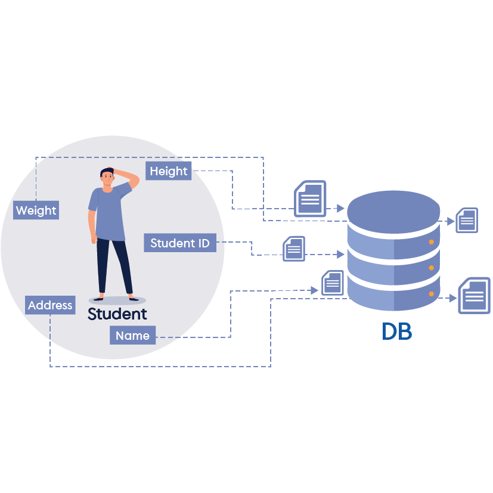
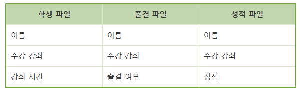
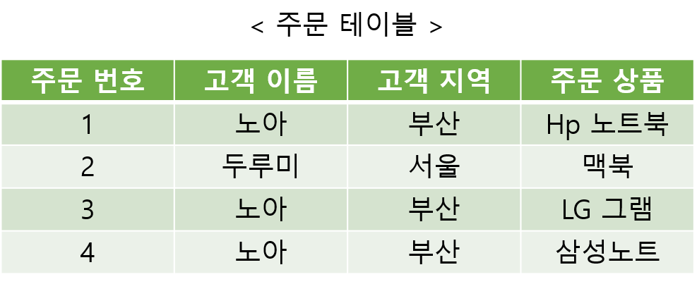
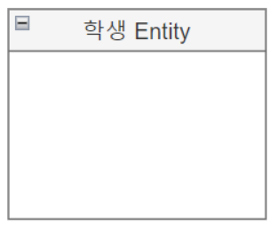
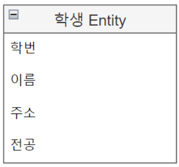
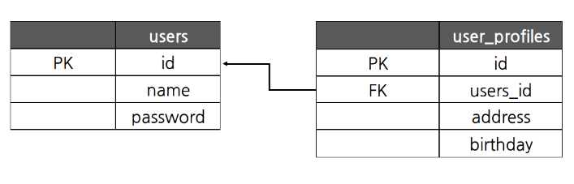
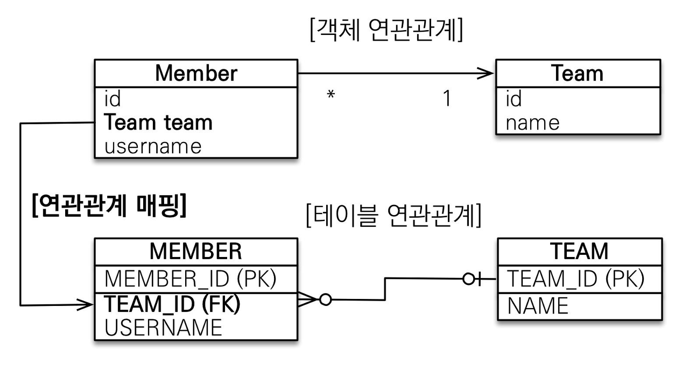
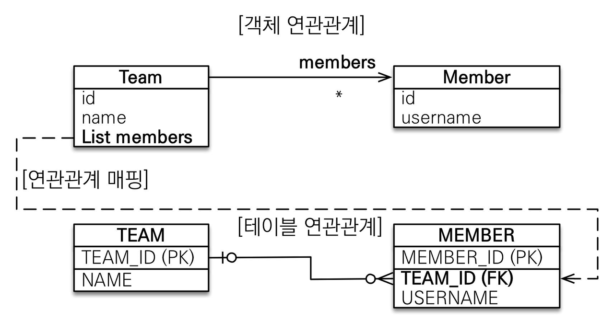
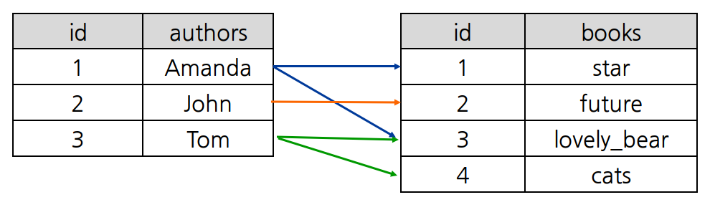
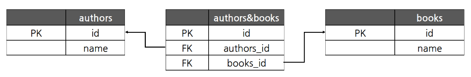

# :cherry_blossom: DataBase?

- 특정 조직의 여러 사용자가 `공유`하여 사용할 수 있도록 `통합`해서 `저장`한 `운영` **데이터의 집합**

- 특정 목적을 가진 정보의 집합체

 

## :seedling: Database 정의

- 공유 데이터 (shared data)

  - 하나의 프로그램에 종송된 것이 아닌, 다수의 사용자와 프로그램이 사용할 수 있음

- 통합 데이터 (integrated data)
  - 분산된 데이터를 한 곳으로 모아 중복을 최소화 => 데이터의 일관성 유지 및 관리 비용 감소
- 저장 데이터 (stored data)
  - 컴퓨터 저장장치 (HDD, SSD..)에 저장되는 데이터
- 운영 데이터 (operational data)
  - 임시적으로 처리하는 데이터가 아닌 시스템을 운영하기 위해 필요한 데이터
     조직 고유의 업무를 수행하기 위해 지속적으로 유지해야 하는 데이터

## :seedling: Database 특징

- 실시간 접근성 (Real-Time Accessibility)

  - query(쿼리, DB에 정보를 요청)에 대해 실시간 응답/처리

- 지속(계속)적 변화 (Continous Evolution)
  - 데이터의 삽입, 삭제, 수정에 의해 항상 최신 데이터를 유지 (동적 상태)
- 동시 공유 (Concurrent Sharing)
  - 여러 사용자가 동시에 같은 내용의 데이터 이용 가능
- 내용 기반 참조 (Contents Reference)
  - DB의 데이터를 참조할 때 데이터의 주소나 위치가 아닌, 데이터 내용으로 데이터 참조

 

_"DB는 실시간으로 모두가 공유하는 데이터를 내용에 따라 참조하여 변화시킬 수 있어야 한다."_

> **Data** : 관찰, 실험, 조사를 통해 얻은, 가공되지 않은 사실이나 값 (단순 수집)
>   **정보** : 데이터를 처리해서 의미있고 쓸모있게 만든 것 (목적, 의미 포함)

 

# :cherry_blossom: 데이터베이스 관리 시스템 (DataBase Management System, DBMS)

- 개발자는 DB에 직접 접근하여 데이터를 다루는 것이 아닌, DBMS를 이용해 데이터를 관리

- 파일 시스템이 가진 **데이터 종속성** 과 **데이터 중복성** 해결

 

**데이터 종속성**

: 데이터와 응용 프로그램 간의 상호 의존 관계
 
 종속성 :arrow_up: => 데이터 수정시 해당 파일과 관련된 응용 프로그램도 같이 변경돼야 함
  종속성이 높은 예시로, 위의 그림이 있다. 모든 파일이 `이름` 과 `수강 강좌` 를 공통으로 가지고 있다. 이때 학생 파일에 있는 `이름` 데이터를 변경한다면 나머지 파일들도 똑같이 변경을 해줘야 하는 번거로움이 생긴다.

**데이터 중복성**

: 한 시스템에서 같은 데이터가 중복돼서 저장, 관리되는 것
 파일 시스템에서는 데이터 파일과 응용 프로그램이 일대일로 대응돼야 했음 =>> 데이터 내용이 같더라도 구조가 다르면 별도의 파일을 만들어야 했다.

DBMS는 `데이터 중복 최소화` `데이터 공유` `데이터 일관성` `데이터 무결성` `데이터 보안` 을 장점을 가짐으로써 위의 문제성을 보완

> **데이터 중복 최소화** : 데이터를 통합으로 관리함으로써 데이터 중복 최소화
>   **데이터 공유** : 데이터 공유로 인해 응용 프로그램의 데이터 관리 부담 :arrow_down:
>   **데이터 일관성** : 데이터가 논리적으로 일치하여 모순이 없는 상태
>   **데이터 무결성** : 현실 세계의 값과 DB의 데이터 값이 일치하는 정확성
>   **데이터 보안** : 다수가 DB에 접근하면 보안이 매우 취약 => DBMS가 알아서 처리

 

## :seedling: DB 종류

데이터 구조와 사용 목적에 따라 여러 가지로 분류될 수 있음

- 계층형 데이터베이스 (Hierachical DB, HDB)

  - 트리 형태의 계층적 구조로 데이터 저장
  - 최상위 계층의 데이터부터 검색하는 구조

- 네트워크형 데이터베이스 (Network DB, NDB)
  - 데이터 구조를 네트워크상의 노드 형태로 표현
  - 각각의 노드(데이터)를 서로 대등한 관계로 구성
- 관계형 데이터베이스 (Relational DB, RDB)
  - 2차원 테이블의 형태로 데이터 구조 구성
  - 테이블 내의 컬럼 중 일부를 다른 테이블과 중복시켜 상관관계 정의
- 객체지향 데이터베이스 (Object ORiented DB, ODB)
  - 데이터를 객체로 관리
  - 멀티미디어와 같이 복잡한 데이터를 처리
- 비관계형 데이터베이스 (noSQL DB)
  - 데이터 간의 관계 정의 :x:
  - 복잡하거나 큰 용량의 데이터를 다룰 때 사용

 

현재 가장 많이 사용하는 DBMS가 **RDBMS**이기에 이것에 대해 알아보겠다.

 

# :seedling: 관계형 데이터베이스 관리시스템 (Relational DBMS, RDBMS)

- 행 (row)과 열 (column)을 가진 테이블로 데이터 표현

- 표준 언어인 SQL (Structured Query Language) 을 이용해 관리 및 접근

> :heavy_plus_sign: **용어 정리**  행 (row) : 각 데이터 항목, 레코드(recode) 라고도 불림
>   열 (column) : 항목의 속성(명칭), 필드(field) 라고도 불림
>   값 (value) : 각 행과 열에 대응되는 값 (column의 타입에 맞는 값)
>   키 (key) : 하나의 테이블을 구성하는 여러 열 중에서 특별한 의미를 지닌 열(들) (기본 키, 후보 키, 외래 키, 복합 키...)
>   관계 (relationship) : 데이블이 관계 맺는 상대 테이블의 수로 결정됨, 외래키 사용 (일대일 관계, 일대다 관계, 다대일 관계, 다대다 관계)
>   스키마 (schema) : 테이블 생성을 위한 도안 (각 열의 항목과 타입 뿐만 아니라 기본 키와 외래 키 등을 나타냄)

 

이름에서 알 수 있듯이 RDBMS는 테이블 간의 관계를 가진다.

사용자의 데이터를 저장할 때 하나의 테이블에 몽땅 다 넣으면 편할 것이다. ~~저장할 때만~~
  특정 고객이 상품을 여러 개 주문했을 경우, 고객 이름과 고객 지역이 중복돼서 저장된다. 이후 해당 고객이 지역을 변경한다면 데이터 수정에 있어 번거로울 것이다. 이런 번거로움을 해결하기 위해 RDBMS는 테이블을 분리해 행과 행을 연결시킨다.

 

주문 테이블과 고객 테이블로 테이블 분리를 시킨다면, 고객이 정보 수정을 했을 때 보다 간단하게 데이터 수정을 할 수 있게 된다. 중복값 또한 줄어들었다. 이렇게 테이블을 분리시킨 뒤 관계를 형성한다면 데이터를 효율적으로 관리할 수 있다.

 

> :heavy_plus_sign: **기본 키 (primary key, PK)**
>
> - 해당 테이블의 고유한 ID
> - 중복된 값 존재:x:
> - 각 row마다 고유의 PK 갖고 있음
>     (위의 테이블에선 고객 번호 필드에 해당)
>
>  :heavy_plus_sign: **외래 키 (foreign key, FK)**
>
> - 관계지은 테이블의 기본 키를 참조하는 필드
> - 각 테이블의 행을 연결시켜주는 역할
>    (위의 테이블에선 주문 테이블의 고객 번호 필드에 해당)
>
>   _테이블 간의 관계는 기본 키와 외래 키를 사용해 맺어짐_

테이블을 분리하고 중복 데이터를 제거하는 과정을 정규화라고 함

 

# :cherry_blossom: ERD

_Entity Relationship Diagram_
 

- Entity와 Relationship을 중점적으로 표시하는 데이터베이스 구조를 나타내는 다이어그램
   (개체 관계도라고도 불림)

- 시스템의 엔티티들이 무엇이 있는지 어떤 관계가 있는지 나타내는 다이어그램
    (테이블들의 관계를 시각적으로 표현할 수 있어 설계시 문제점 파악 용이)
- 관계형 데이터베이스 모델링에 주로 사용

## :seedling: ERD 요소

### Entity

- 정의 가능한 사물 또는 개념
- DB의 테이블에 해당

 

### Attribute

- 엔티티 개체가 갖고 있는 속성
- 테이블의 columns에 해당 (자료형 함께 작성해야 함)

(Attribute = 학번, 이름, 주소, 전송)

 

### Relationship

- 두 엔티티가 서로 관련있음
- `일대일(1:1) 관계 `, `일대다(1:N) 관계`, `다대일(N:1 관계)` , `다대다(N:M) 관계`의 관계 있음

**1. 일대일 (1:1, one to one) 관계**

   

테이블의 행이 서로 1:1 매칭 (한 줄씩)

**2. 다대일 (N:1, many to one) 관계**

_가장 많이 사용하는 연관 관계_
 
 하나의 team에는 다수의 member가 포함될 수 있지만, 하나의 member는 하나의 team에만 포함돼야 한다. 이렇게 한 쪽 방향으로만 다수와 관계를 지을 수 있을 때 `many to one` 관계라고 한다.
 (FK가 있는 엔티티 = 관계의 주인, 주인이 아닌 엔티티 = 단순 조회만 가능)
 
  _(대부분, FK = Many 엔티티로 둠)_

> :heavy_plus_sign: `@ManytoOne`으로만 `단방향` 연관관계를 짓는 것이 **정석**
>
> - 양방향을 무분별하게 사용하면 엔티티 간의 관계를 복잡하게 만듦
>
> - 양방향에서 한쪽을 변경하면 다른 쪽도 반영해야 함 => 동기화 문제 발생 가능성 :o:
> - `@OnetoMany` 가 아니라 `@ManytoOne` 인 이유는 아래쪽에서!

 

**3. 일대다 (1:N, one to many) 관계**

 

_실무에선 추천하지 않는 모델_
 
다대일과 같은 개념! 다만 관계의 방향성에서 차이점과 단점이 드러난다.
 
 그림의 객체 연관관계를 보면 Team이 Member쪽으로 화살표 방향이 가는 것을 확인할 수 있다. (`@OnetoMany`니까) 또한 `@OnetoMany`는 무조건 Many 엔티티가 FK를 관리한다. 결과적으로 FK를 one쪽, 즉 Team 객체가 관리하게 된다. 이렇게 된다면 Team 객체를 변경했는데 딩시에 Member 테이블도 업데이트가 되는 상황이 발생할 수 있다.

 

**4. 다대다 (N:M, many to many) 관계**

   

amanda가 star와 lovely_bear를 출판했다. 이때 공통 저자로 Tom이 들어갔다. 이런 상황에서 한 권의 책은 다수에 의해 출판될 수 있고, 한 명의 저자는 여러 권의 책을 출판할 수 있다.
 
이럴 때를 `many to many` 라고 함
 
  다대다 또한 실무에서 지양해야 하는 방식!
  자바는 Collection을 사용해 객체만 2개 있어도 다대다 매핑을 할 수 있지만 (**ORM**) RDBMS는 그렇지 않다. 정규화된 테이블 2개를 다대다 매핑을 할 수는 있지만 사용에 있어 문제가 있다.
 
  다대다 패밍을 하면 시스템이 중간 테이블을 자동 생성해준다. 자동 생성된 이 테이블은 두 테이블의 ID만을 연결해주는 역할만 한다. 때문에 추가적으로 필드를 테이블에 생성할 수 없다. 이를 극복하기 위해서는 아래와 같이 `N : M` 을 `1 : N` 관계로 이뤄지도록 만든다.

authors&books 엔티티를 따로 만든 뒤, authors, books 엔티티와 `@OnetoMany` 관계를 지어준다 (이때 관계의 주인 = author&books)
