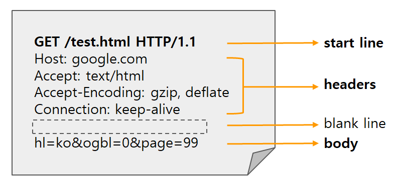
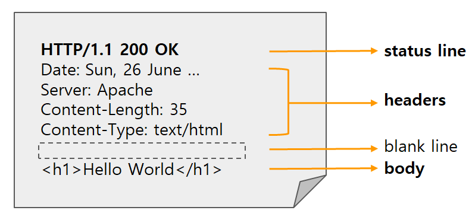

# :chicken: HTTP 요청과 HTTP 응답

 

`HTTP(HyperText Transfer Protocol)` 은 기본적으로 `request(요청)` 과 `response(응답)` 의 구조로 이루어졌다.
  클라이언트가 HttpRequest를 서버에 보내면 서버는 요청에 맞는 HttpResponse를 클라이언트에게 보낸다. _(클라이언트와 서버의 모든 통신은 요청과 응답으로 이뤄짐)_

> :question: **HTTP** >   :exclamation: 네트워크끼리, 서버끼리 통신을 할 때 어떠한 형식으로 서로 통신하자고 규정해 놓은 "통신 형식" 또는 "통신 구조"
>   - `클라이언트` 와 `서버` 통신에 사용

**HttpRequest**

 

HTTP 프로토콜 요청 메시지 (클라이언트 :arrow_right: 서버)
  HttpRequest는 공백(blank line) 을 제외하고 3가지 부분으로 나눠짐

- Start Line

  - Http Request Message의 시작 라인
  - `HTTP Method` `Request target` `HTTP version` 의 3가지 부분으로 구성

    - HTTP Method : 요청의 의도 (GET, POST, PUT, FETCH, DELETE)

    - Request targer : HTTP Request가 정송되는 목표 주소
    - HTTP version : HTTP의 version에 따라 Request 메시지의 구조 또는 데이터가 다를 수 있기 때문에 명시

- Headers

  - 해당 Request의 추가 정보를 담고 있는 부분

  - `General Header` `Request Header` `Entity Header`

    - General Header : 요청이 이뤄지는 날짜 및 시간 등에 대한 일반적인 정보
       _(요청과 응답에 모두 적용됨, 최종적으로 전송되는 데이터와는 관련없는 헤더)_

    - Request Header : 메시지가 아닌 리소스와 클라이언트에 대한 자세한 정보만 포함 (HTTP 요청에서 사용됨)
    - Entity Header : Body에 대한 정보 포함

- Body (== Entity Body)
  - HTTP Request가 전송하는 데이터를 담고 있는 부분 (전송 데이터 :x: => body 부분 비어있음)
  - 다양한 형태의 데이터 포함 가능 (HTML, XML, JSON, CSS...)
     위의 그림은 폼 데이터 (Form Data)

<pre><code>// json 데이터 형태
{"test_id": "tmp_1234567", "order_id": "8237365"}</code></pre>

 

**HttpResponse**

HTTP 프로토콜 응답 메시지 (서버 :arrow_right: 클라이언트)
 HttpRequest와 동일한 구조 가짐

- Start Line

  - HttpResponse의 상태를 간략하게 나타내는 부분

  - `HTTP version` `Status Code` `Status Text` 의 3가지 부분으로 구성
    - HTTP version : 통신에서 사용되는 HTTP 프로토콜마다 기능과 구조가 다르기에 명확하게 적어야 함 _(Request와 같은 이유)_
    - Status Code : 요청이 어떻게 처리됐는지 알려주며 세 자리 숫자로 구성 (성공 및 실패 여부와 함께 원인 파악이 가능)
    - Status Text : Status Code와 함께 적으며 상태 코드에 대한 간단한 설명

- Headers
  - 해당 Response의 추가 정보를 담고 있는 부분
  - `General Header` `Response Header` `Entity Header`
    - General Header : 응답이 이뤄지는 날짜 및 시간 등에 대한 일반적인 정보
    - Response Header : 위치 또는 서버에 대한 정보 포함
    - Entity Header : HttpRequest와 동일
- Body (== Entity Body)
  - HTTP Reponse가 전송하는 데이터를 담고 있는 부분 (전송 데이터 :x: => body 부분 비어있음)
  - 다양한 데이터 형태 가능 (HTML, XML, JSON, Form Data...)
     위의 그림은 HTML코드

<pre><code>// json 데이터 형태
{"name": "John Doe", "age": 30}</code></pre>

## :baby_chick: ResponseEntity?

서버는 클라이언트의 응답을 처리한 뒤, 결과 값을 클라이언트에게 다시 보내줘야 한다.  이때 String으로 보내는 것이 아니라 `ResponseEntity` 를 사용해 응답값을 보내주는 것이 일반적이다. 왜일까? 아래 코드를 한번 보자.

<pre><code>@GetMapping("/")
public User getUser() {
    User user = userService.getUser();
    return user;
}</code></pre>

클라이언트에게 user 객체를 통채로 보내는 코드이다.  클라이언트는 user객체를 보고 요청한 대로 처리가 성공했는지, 실패했는지, 만약 실패를 했다면 어떻게 실패를 했는지 알아볼 수 없다. 또한 spring이 HttpResponse의 요소들을 채워준다 한들, 특정 상황에서는 개발자가 추가로 작업해줘야 한다. (쿠키 설정, 캐싱 정책..)
  _(상태코드를 적지 않으면 스프링은 기본적으로 `200 OK` 상태 코드를 클라이언트에게 전송함)_

spring은 HTTP 응답을 유연하고 세밀하게 조작할 수 있는 `ResponseEntity 클래스` 를 제공한다.

- HttpEntity를 상속받아 구현한 클래스
- 사용자의 HttpRequest에 대한 응답 데이터를 포함
- HttpStatus, HttpHeader, HttpBody 포함 (Http Request 전체를 표현하는 클래스)

 

> :heavy_plus_sign: HttpEntity
>
> <pre><code></code>public class HttpEntity<T> {
> 
>    public static final HttpEntity<?> EMPTY = new HttpEntity();
>    private final HttpHeaders headers;
>    private final T body;
>    ...
> }</pre>
>
> Http 요청 및 응답에 해당하는 `HttpHeader` 와 `HttpBody` 를 포함하는 클래스

 

<pre><code>public class ResponseEntity<T> extends HttpEntity<T> {
	
	public ResponseEntity(@Nullable T body, @Nullable MultiValueMap<String, String> headers, HttpStatus status) {
		super(body, headers);
		Assert.notNull(status, "HttpStatus must not be null");
		this.status = status;
	}
}</code></pre>

ResponseEntity는 body, headers, status 파라미터를 가진 생성자를 호출
 _(status만, body&status 의 파라미터만을 갖는 생성자 2개 더 있음)_
