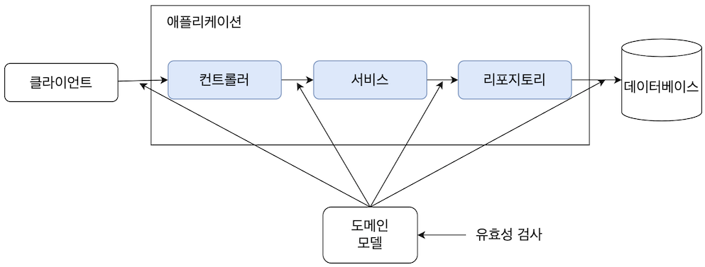
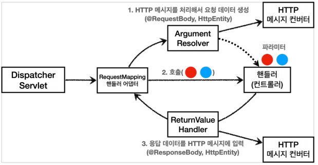

# :deciduous_tree: 유효성 검사?

사용자로부터 입력된 데이터가 조건에 충족하는지 즉, 유효한지 검사하는 것

:question: **유효성 검사를 왜 할까?**

- 올바르지 않은 데이터를 서버 또는 DB로 전송되는 것을 막기 위함

- DB는 데이터의 무결성을 지켜야 함 => 유효성 검사로 데이터의 정확성, 일관성, 완전성 보장
- 항상 일정한 형태의 데이터를 사용자에게 제공 가능
  <br>

## :evergreen_tree: 유효성 검사 위치 in Spring

유효성 검사의 위치에 명확하게 정해진 기준은 없음. 상황에 따라 적절한 검사를 하면 된다. <br>

**Client와 Server** <br>
Client와 Server 모두 유효성 검사 가능하다.<br>

- Client

  - 유효성 검사 가능

  - 사용자가 개발자 도구 사용으로 코드를 변경시켜 유효성 검사를 넘기는 상황 발생 가능성 O
  - DB를 통한 유효성 검사 X

- Server
  - 안정적 유효성 검사 및 DB를 통한 유효성 검사 가능
  - Client의 몫까지 다 할 수 있음 but, 검사할 일이 늘어나는 것이니 속도 처리 속도 느려짐

결과적으로 Client와 Server에 유효성 검사를 적절히 분배해야 한다.

---

<br>

그렇다면 Server인 `Spring` 에서 유효성 검사를 어디에서 해야 할까?



사용자가 입력한 데이터는 각 계층을 지난다. 계층 간 전송되는 데이터로 DTO 객체를 주로 활용하기 때문에 DTO 객체에 대한 유효성 검사를 수행하는 것이 일반적이다.<br>
_(유효성 검사는 모든 계층에서 가능하다.)_<br>

- **Controller**

  - 사용자의 입력을 처음 받는 곳

  - 사용자의 요청 데이터에 대한 초기 유효성 검사 수행 가능
  - 주로 입력 형식이 올바른지 확인하는 데에 중점 (ex. 아이디, 비밀번호, 이메일 형식 확인)

- **Service**

  - 비즈니스 로직 (중복 체크, 인증 처리, 재고 확인..) 을 처리하는 계층

  - 데이터의 유효성뿐만 아니라 비즈니스 규칙에 대한 검증도 수행 가능
  - 주로 비즈니스 규칙을 반영하는 데에 중점 (유효성 검사를 하고 싶으면 @Validated 이용하기)

- **Repository**

  - DB와의 상호작용을 하는 계층

  - DB 스키마의 제약 조건에 대한 검증 일어남
  - 유효성 검사 수행은 드묾 (유효성 검사를 하고 싶으면 @Validated 이용하기)

<br>

유효성 검사는 보통 Controller에서 진행한다. 사용자의 입력을 제일 처음 받는 곳이며, 잘못된 데이터가 시스템 깊숙이 들어가는 것을 바로 걸러낼 수 있다.
<br>
<br>
Controller 이외의 계층에서도 검사를 진행할 수 있지만, 각 계층의 주요 책임들이 존재한다. 책임에 집중할 수 있도록 이 전 층에서는 전송 데이터 검사를 적절하게 진행하는 것이 좋다.
<br>
<br>
그렇다고 모든 검사를 Controller에 의존하는 것 또한 바람직하지 않다. (한 계층이 다른 계층을 의존하는 것은 좋지 않음)<br>
Controller에서 Service로 정상값이 항상 전달된다는 보장이 없다. 상황에 맞는 검사를 진행하자.
<br>
<br>
추가로 계층 간 데이터 전달을 위해 사용되는 `DTO`와 DB와 연결돼 사용하는 `Entity` 또한 마찬가지이다. 계층-계층으로 DTO가 전달돼 Entity에 데이터가 들어갈 텐데, 이때 DTO에 정상 데이터가 담겨있다고 확신할 수 있나? 때문에 DTO와 Entity에도 유효성 검사를 해주는 것이 좋다.

## :evergreen_tree: @Valid vs @Validated

**@Valid**<br>

- 자바 기본 라이브러리에서 제공하는 어노테이션 (자바 표준 스펙)

- 객체에 대해 검사
- Controller에서만 유효성 검사

```
// 작성 예시
@RestController
public class TestController {

    @PostMapping("/todos/save")
    public ResponseEntity<String> createTodo(@RequestBody @Valid TodoRequest request){

        return ResponseEntity.ok().body("Todo 생성 성공");
    }
}
```

<br>
<br>

**동작 과정**



`@Valid` 를 이용한 유효성 검사는 `Argument Resolver` 에 의해 이루어진다. <br>

1. Front Controller인 DispatcherServlet에 모든 요청이 전달
2. 해당 요청을 위한 핸들러를 실행할 수 있는 Handler Adapter로 요청 처리 시작
3. 찾은 Controller 메소드에 파라미터를 바인딩하기 위해 Argument Resolver 등장
4. Argument Resolver가 @Valid로 시작하는 어노테이션이 있는 경우, 유효성 검사 진행
   <br>

검사 실패시, `MethodArgumentNotValidException` 예외 발생
<br>(DispatcherServlet에 기본으로 등록된 Exception Resolver인 DefaultHandlerExceptionResolver에 의해 400 Bad Request 에러 발생)

> :question: **Argument Resolver** <br>
> 쿼리 스트링을 컨트롤러의 파라미터에 바인딩하려면 `@RequestParam`, 경로를 바인딩하려면 `@PathVariable`, Http Body를 바인딩하려면 `@RequestBody` 를 사용해 적절하게 파라미터를 변환시켜야 한다. 이렇게 컨트롤러의 파라미터 조건에 맞도록 변환시켜주는 것을 Argument Resolver가 해준다.<br>
> 컨트롤러 메소드가 호출되기 전, 메소드의 파라미터를 준비하는 역할을 하는 것이다. 이때 @Valid 어노테이션이 붙어있으면 바인딩 과정에서 유효성 검사를 한다.

<br>

**@Validated** <br>

- Spring FrameWork에서 제공하는 어노테이션

- Controller가 아닌 다른 계층에서도 유효성 검사 가능

```
// 작성 예시
@Service
@Validated
public class TestTodoService {

    public ResponseEntity saveTodo(@Valid TodoRequest request){

        return ResponseEntity.ok().body("Todo 저장 성공");
    }
}
```

<br>

**동작과정** <br>

@Validated는 AOP 기반으로 메소드 요청을 인터셉터해 처리한다.<br>

1. 클래스에 선언을 했을 때, 해당 클래스에 유효성 검증을 위한 인터센터인 `MethodValidationInterceptor` 등록됨
2. 해당 클래스를 호출할 때 AOP의 PointCut이 요청을 가로채 유효성 검사 진행

검사 실패시 `ContraintViolationException` 예외 발생

## :evergreen_tree: 유효성 검사를 위한 어노테이션

유효성 검사를 할 객체의 각 필드에 원하는 어노테이션을 추가하면 됨 <br>

```
// 작성 예시
@Data
public class SignUpDTO {
    @NotBlank(message = "아이디를 입력하세요.")
    @Pattern(regexp = "(?=.*[a-zA-Z])(?=\\S+$).{5,10}", message = "아이디 : 5~10자")
    private String userId;
}
```

- **@NotNull** : 해당 값이 null이 아닌지 검증

- **@NotEmpty** : @NotNull + ""(빈 스트링) 이 아닌지 검증
- **@NotBlank** : @NotNull + @NotEmpty + 공백(" ") 이 아닌지 검증
- **@Email** : 이메일 형식인지 검증
- **@Size(min=,max=)** : 주어진 값 사이에 있는지 검증 (String, Collection, Map, Array 에도 가능)
- **@Min(숫자)** : 숫자값보다 이상인지 검증
- **@Max(숫자)** : 숫자값보다 이하인지 검증
- **@Pattern(regex=)** : 주어진 패턴(정규표현식)과 일치하는지 검증
- **@AssertTrue** : 항상 값이 true 여야 함
